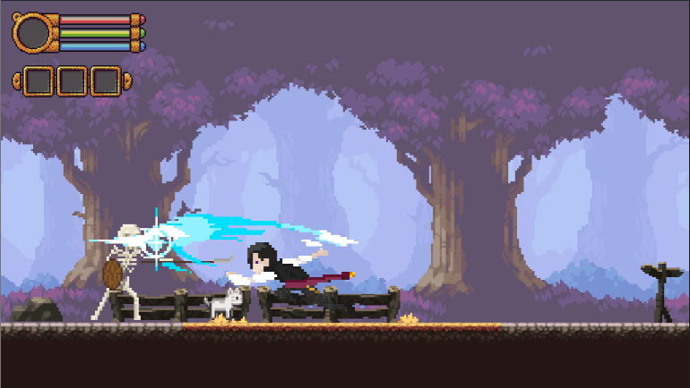

# Theo's Journey - JavaScript Game

Theo's Journey é um jogo de aventura e mistério desenvolvido em JavaScript. Você assume o papel de Theo, um aristocrata que, após não receber respostas de suas cartas, decide retornar à sua casa apenas para encontrar algo terrivelmente errado. Explore o ambiente, descubra pistas e enfrente desafios para revelar a verdade por trás dos eventos estranhos.

## História

Theo, o aristocrata que vivia a anos longe de sua casa, tentou entrar em contato com sua família através de cartas, porém não obteve respostas. Decidido a descobrir o que aconteceu, ele retorna à sua antiga residência. Ao chegar, Theo presencia um pedaço de vestido ensanguentado no chão. Quando ele se aproxima para investigar, um esqueleto aparece e vai em direção a ele, iniciando sua jornada de mistério e perigo.

## Features

- **Gráficos em Pixel Art**: Desfrute de belos gráficos em pixel art que trazem uma atmosfera nostálgica e imersiva.
- **História Envolvente**: Uma trama cheia de mistérios e reviravoltas.
- **Jogabilidade Intuitiva**: Controles simples e responsivos, perfeitos para uma experiência envolvente.

## Development



## Instalação

Para jogar Theo's Journey localmente, siga as instruções abaixo:

1. Clone este repositório:
    ```sh
    git clone https://github.com/Lucas-Ribeiro-Lima/theos-journey.git
    ```

2. Navegue até o diretório do projeto:
    ```sh
    cd theos-journey
    ```

3. Abra o arquivo `index.html` em seu navegador de preferência.

## Controles

- **Setas Direcionais**: Movimentar Theo.
- **J**: Ataques

## Tecnologias Utilizadas

- **HTML5**
- **CSS3**
- **JavaScript**
- **Canvas API**: Para renderização dos gráficos e animações.

## Contribuições

### Projeto Inicial zFake


Contribuições são bem-vindas! Se você deseja contribuir com o projeto, por favor, abra uma issue ou envie um pull request.

## Licença

Este projeto está licenciado sob a MIT License. Veja o arquivo [LICENSE](LICENSE) para mais detalhes.

## Contato

Para mais informações, você pode me encontrar em:

- **GitHub**: [Lucas Ribeiro Lima](https://github.com/Lucas-Ribeiro-Lima)
- **Email**: lucasribeirolima974@gmail.com
